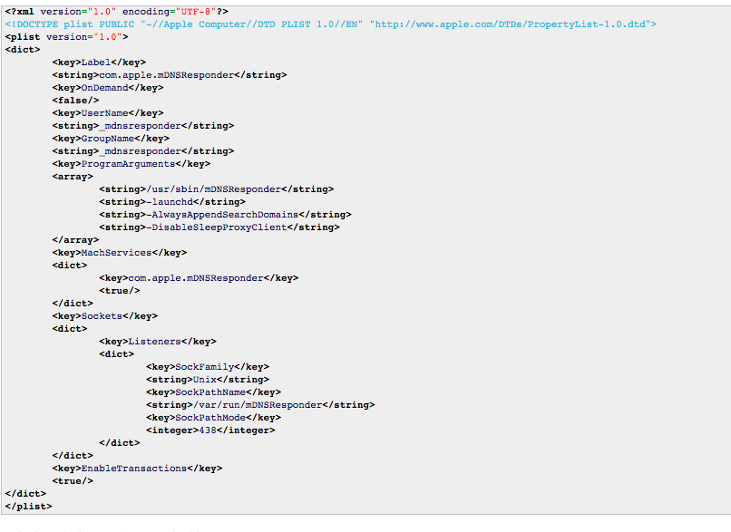

---
## Method for enabling BSD:Syslogs on OSX/macOS to accept incoming connections.

    - See [Here](https://superuser.com/questions/131578/how-do-you-enable-syslogd-to-accept-incoming-connections-on-snow-leopard-from-re).
    - and this:
        

## Socket Disambiguation

    - [Socket keys](osx_changes/socket_keys.png)